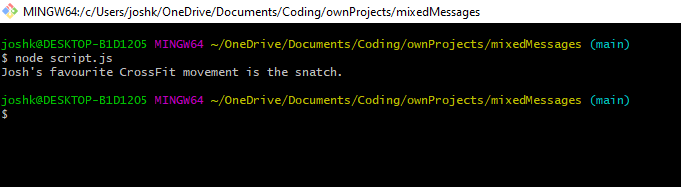

# mixedMessages
> A JavaScript app that randomly generates a CrossFit related message.

## Table of contents
* [General info](#general-info)
* [Screenshots](#screenshots)
* [Technologies](#technologies)
* [Setup](#setup)
* [Features](#features)
* [Status](#status)
* [Inspiration](#inspiration)
* [Contact](#contact)

## General info
This is the first project I've created. It's intended to be a JavaScript app that randomly generates a CrossFit related message. The message is made up of three sections; who the message relates to, the subject the message relates to, and the final 'favourite' declaration. It forms part of the Codecademy full-stack development course.

## Screenshots

## Technologies
* Javascript ES6
* VSCode
* Git versioning

## Setup
To run the app you will require a command line interface (CLI) and the installation of Node.js, which can be downloaded from https://nodejs.org/en/download/.

## Features
Features ready:
* The generation of a random message whenever the app is run.

To-do list:
* Build an associated front end for the app.

## Status
Project is in progress.

## Inspiration
This project was inspired by my personal passion for CrossFit and my wanting to put the skills I had learned from the Codecademy course into practice.

## Contact
Created by [@joshuakent](josh.kent94@yahoo.co.uk) - feel free to contact me!